# PureAudio Player 🎵

**"Offline music, offline peace. Let the local beats speak."**

PureAudio Platinum is a minimalist, high-performance open-source music player designed for audiophiles who want total control over their local library, with unmatched lyrics support.

  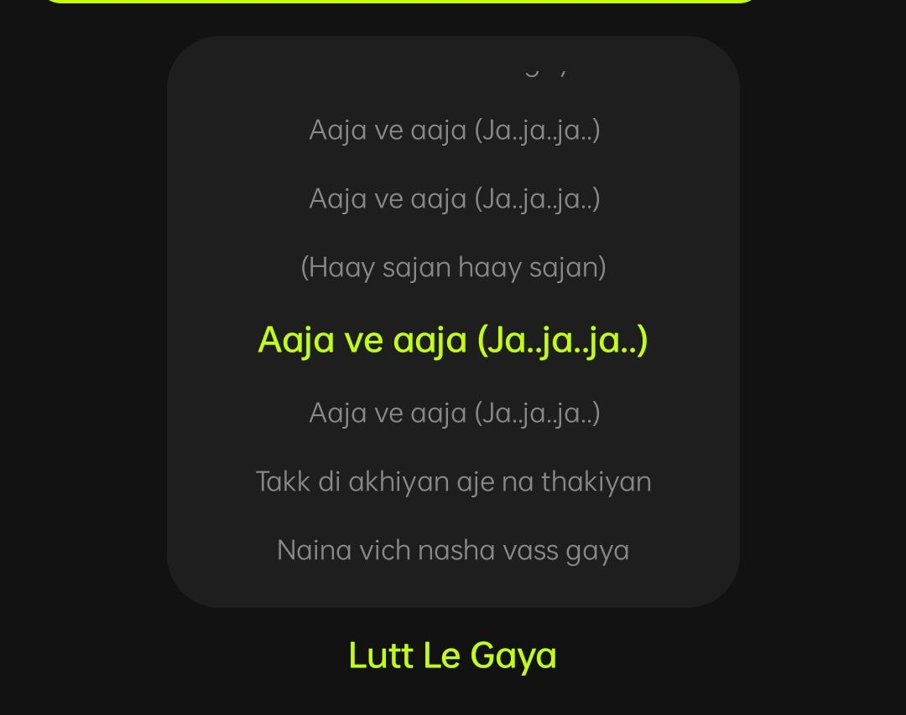
  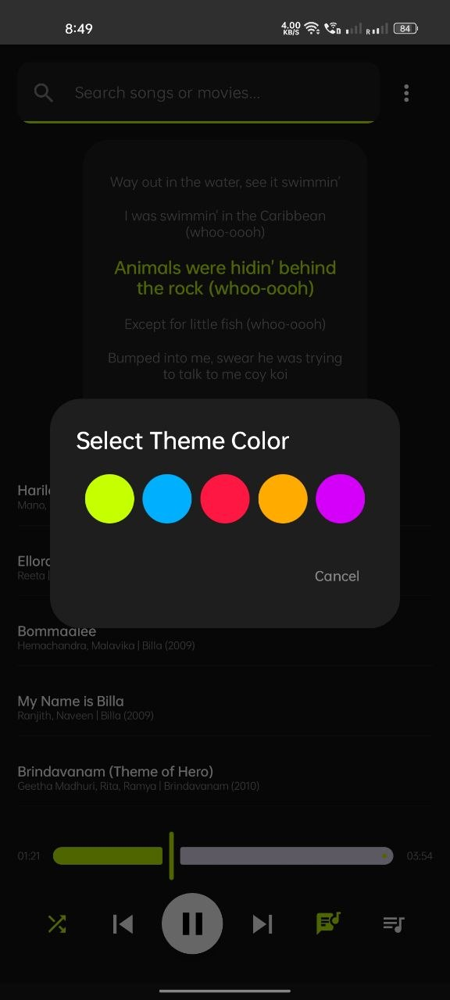
  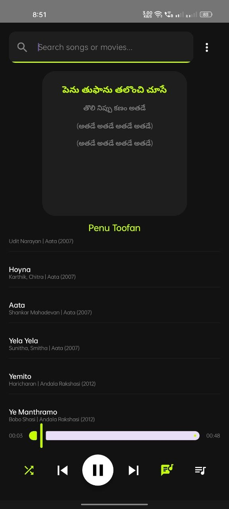
  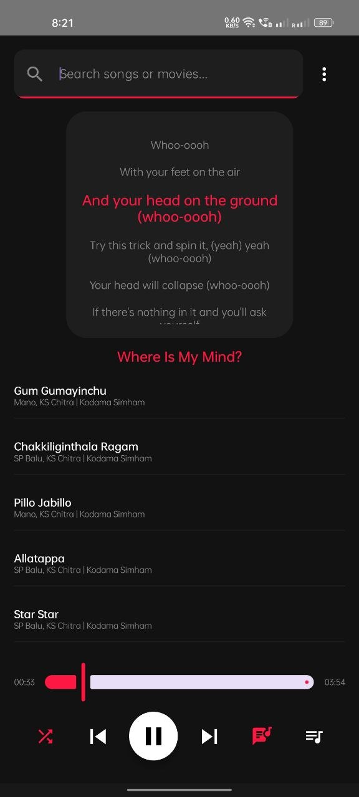
  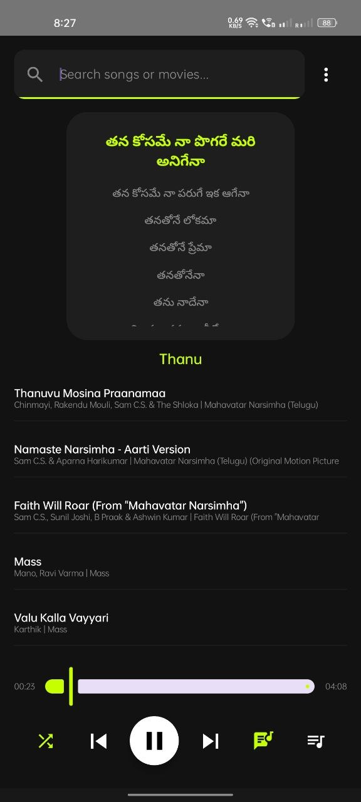
    
  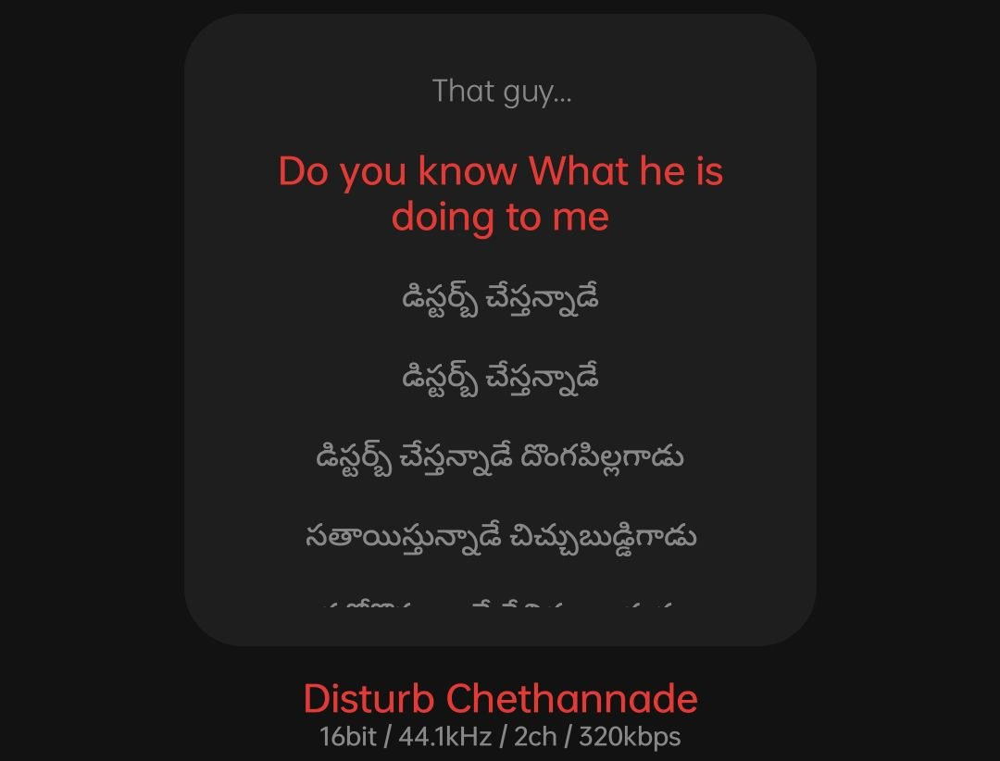
  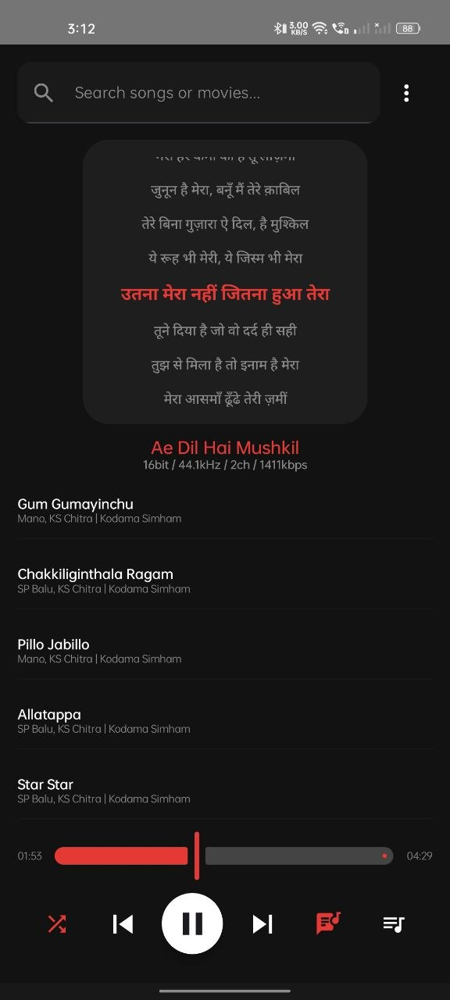
  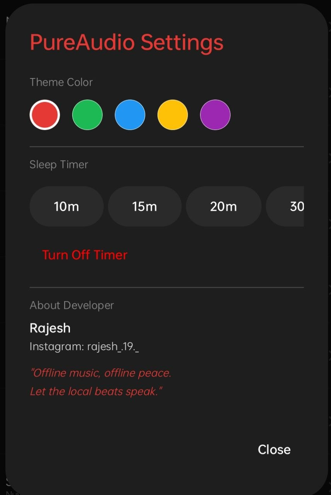
  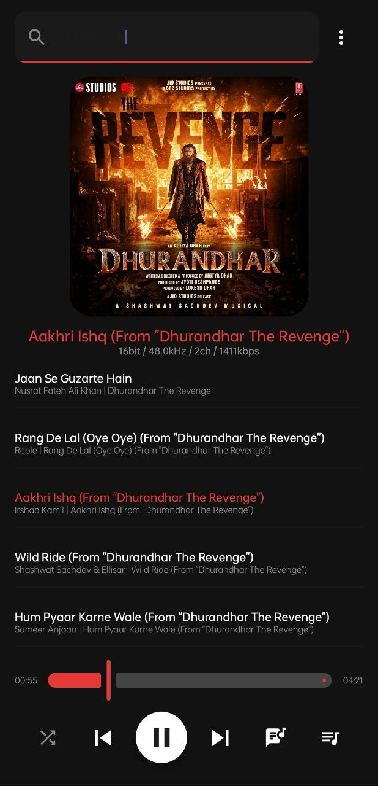
  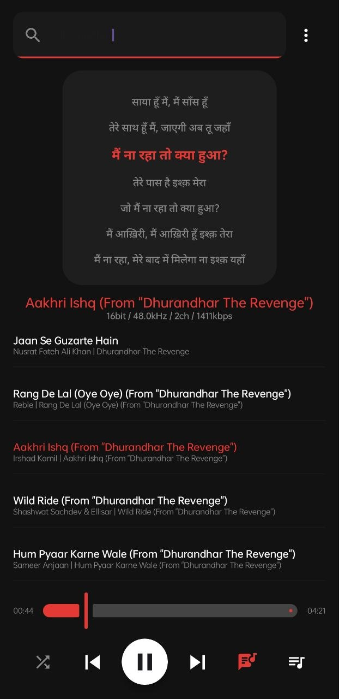
    
  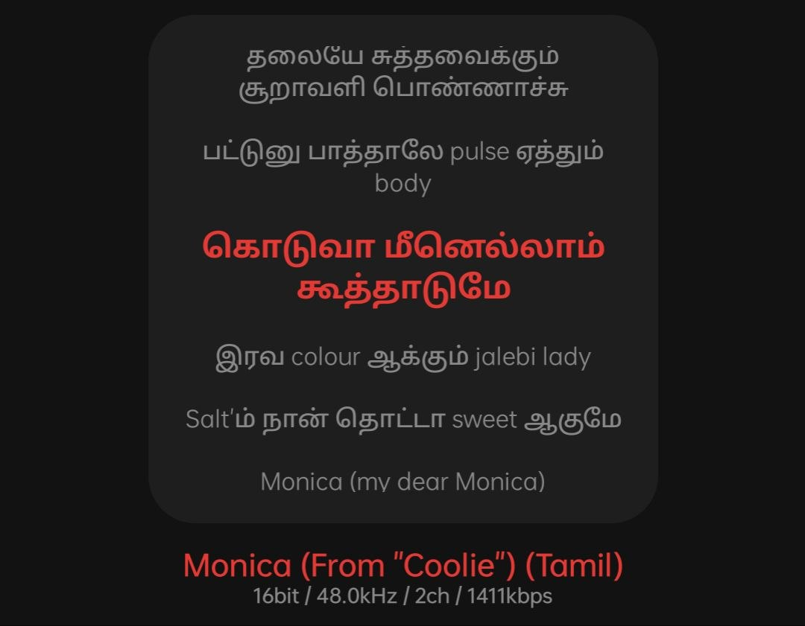
  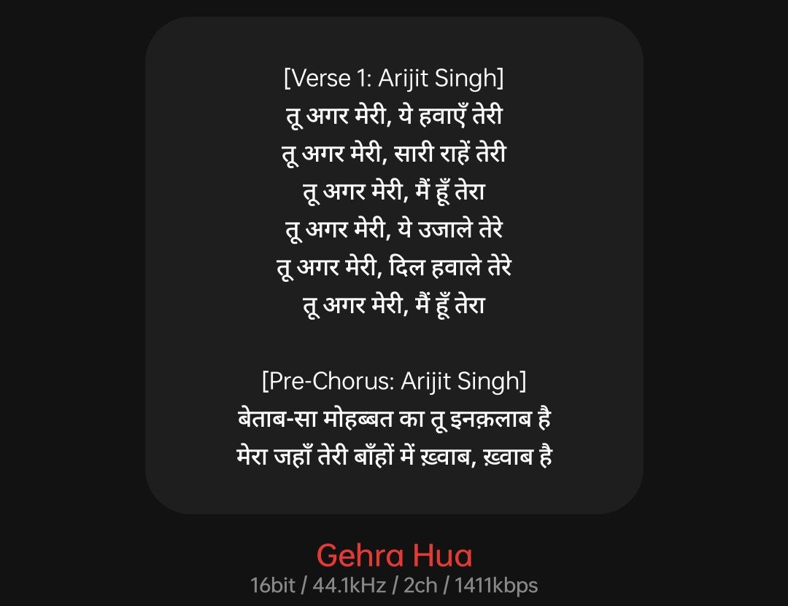
  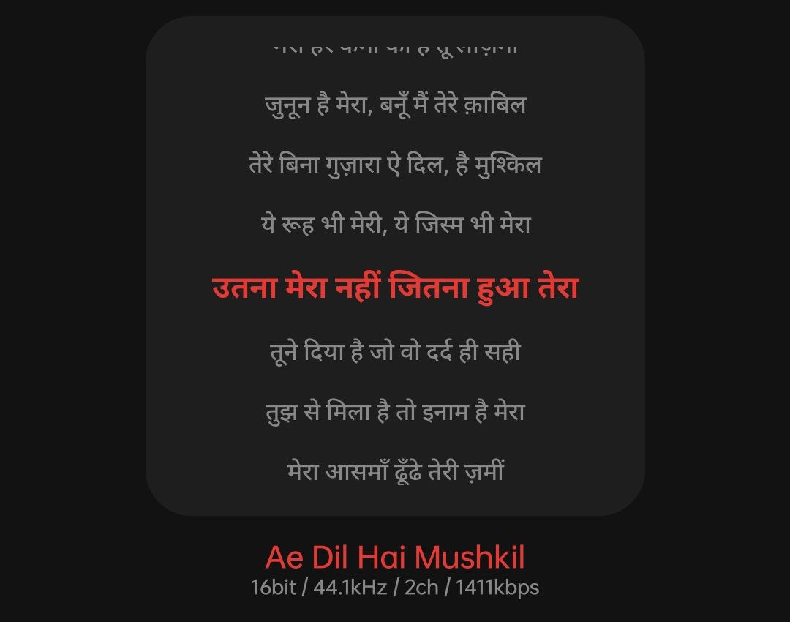

## 🚀 Key Features (Platinum Build)

* **Dual-Engine Lyrics (NEW):** Unmatched lyrics support. PureAudio uses LRCLIB for beautiful, time-synced lyrics, and features a smart fallback to the Genius API for plain-text lyrics, specifically optimizing for regional (Telugu/Indian) tracks that other players miss.
* **Interactive Synced Lyrics:** View real-time karaoke-style lyrics. Tap any line in the synced view, and the player instantly seeks to that exact second.
* **5 Premium Theme Colors:** Instantly customize the entire app UI with Cyber Lime, Electric Blue, Crimson Red, Amber, or Deep Purple neon accents directly from the settings menu.
* **Advanced Queue Management (NEW):** * Long-press any track in your library to **Play Next**.
  * Use the Up/Down arrows in the Playlist view to manually reorder your current queue on the fly.
* **Built-in Sleep Timer (NEW):** Fall asleep to your music. Set a timer (10m, 15m, 20m, 30m, 1hr) and the app will silently pause playback.
* **Zero-Glitch State Engine:** Advanced coroutine state management ensures you never see mismatched lyrics when shuffling rapidly through your playlist.
* **Smart Metadata Scrubber:** Automatically cleans messy track titles (removes "www.songs.com", "[320kbps]", etc.) for highly accurate cover art and lyrics fetching.
* **Audiophile Analytics:** Real-time display of audio quality (Bit Depth / Sample Rate / Channels / kbps) straight from the Media3 engine.

## 📱 Developer Info
* **Developer:** Rajesh
* **Instagram:** [rajesh_.19._](https://www.instagram.com/rajesh_.19._/)

## 🛠️ Built With
* **Language:** Kotlin (Jetpack Compose)
* **Audio Engine:** Media3 ExoPlayer
* **Primary Lyrics DB:** LRCLib API (Synced)
* **Fallback Lyrics DB:** Genius API (Unsynced)
